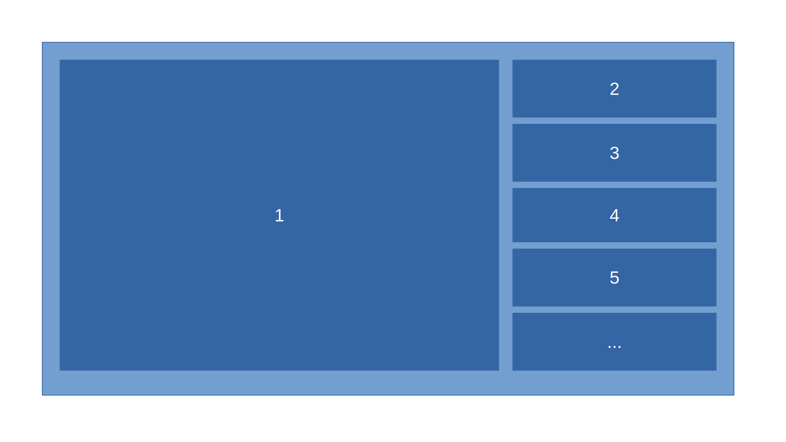
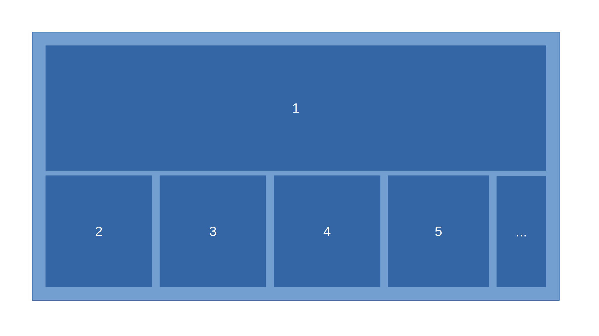
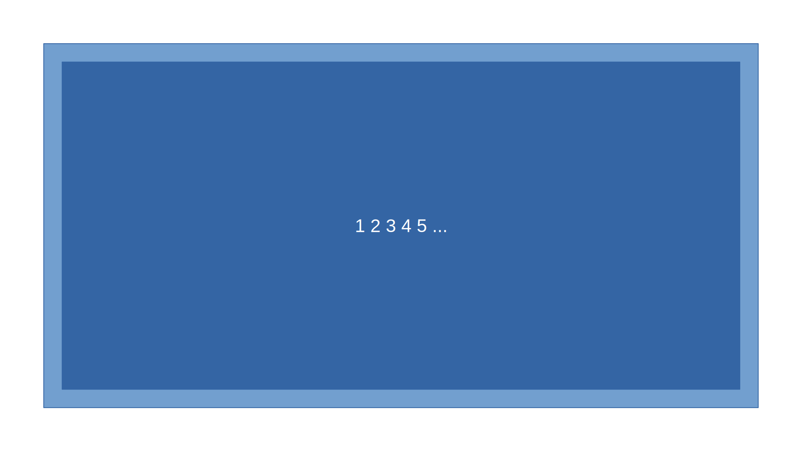
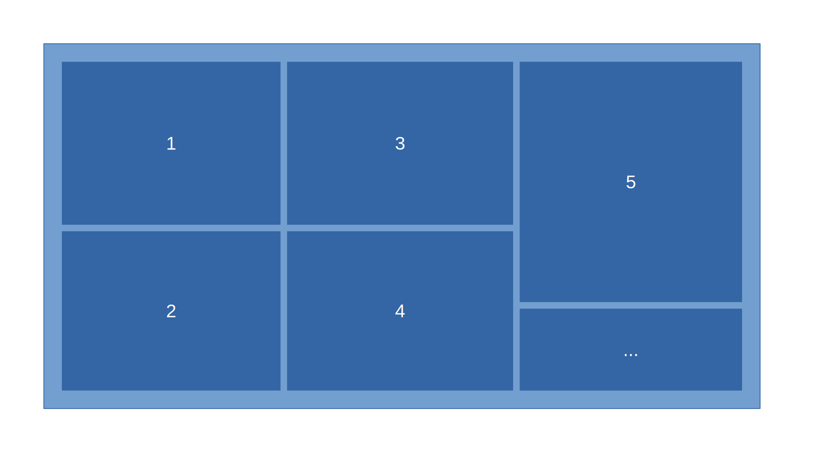
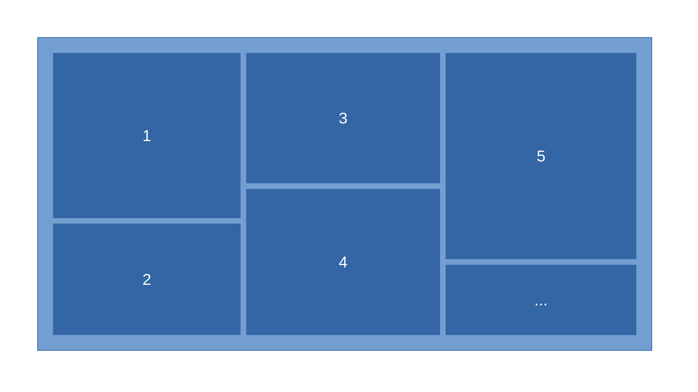
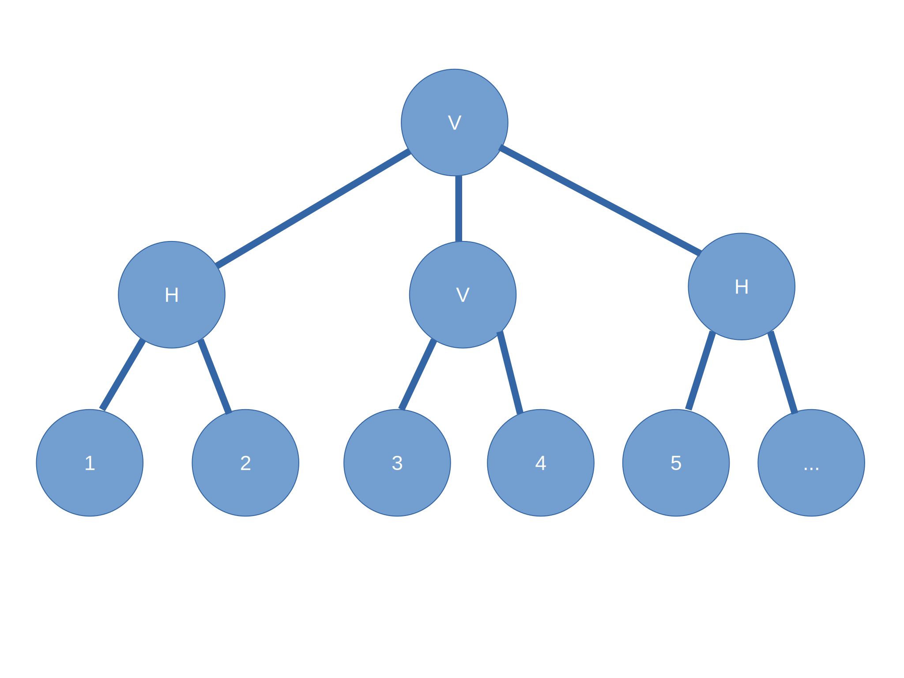
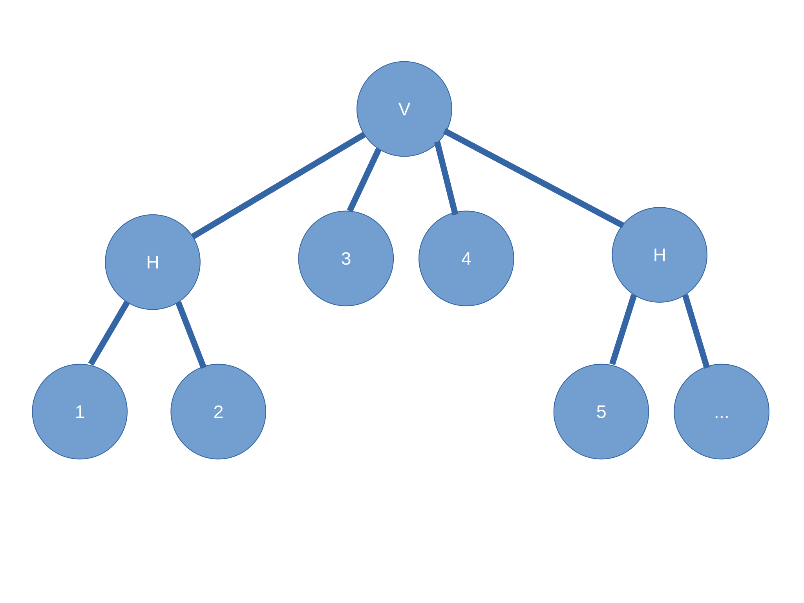

# (sort of) Recommender System for Tilling Windows Manager 
## Tilling Windows Manager
According to wikipedia:
> A tiling window manager is a window manager with an organization of the screen into mutually non-overlapping frames.

Mainly, this is done through *List-based* or *Tree-based* approaches.

### List-based
In this method, windows are items in an ordered list. changing the position of windows in the list, rearrange windows. Different layouts could be applied. To illustrate this, consider a list of windows as *[1, 2, 3, 4, 5, ...]*. Then some layouts are depicted below.

* Stack

* hStack

* Monocle

* Grid

* ...
### Tree-based
in this method, windows are the leaves of a tree. and every internal node is a horizontal or vertical split that divides its own space among its children.

* Example 

Will have the following tree structure. (V representing Vertical split and H representing horizontal split.)

## Tree Structure 
For simplicity let's have an exact kind of tree.

1) Every Window is an leaf.
2) Every interior node is either vertical or horizontal split. (V or H)
3) Every interior node should at least have 2 children.
4) no interior node can have the same type of node as a child.

Case 4 will make trees like picture above to something like tree below.

If we ignore the order of children of each node, the number of possible trees with *N* windows is double (one with V and other with H as root) the *Nth* number in sequence [A196545](https://oeis.org/A196545).
